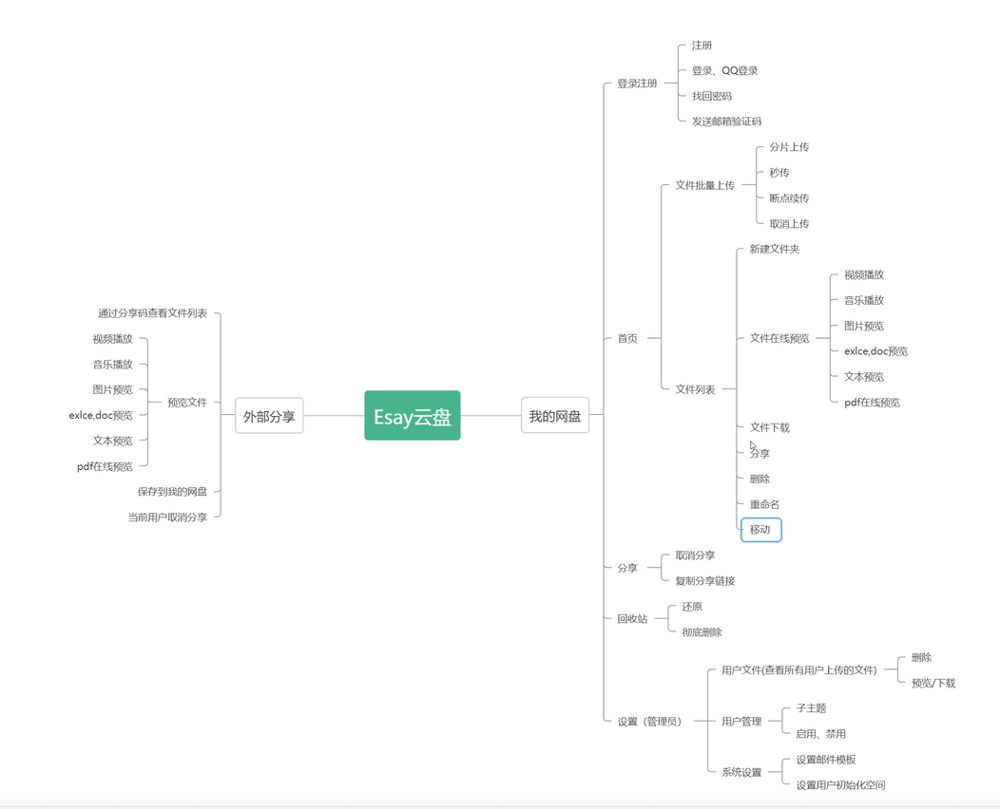

B站复刻项目
基本功能

${springboot.version} 是一个属性,它的值会在构建过程中被替换。

这样做的好处是:

可以集中管理版本号,不需要在每个依赖中单独指定版本号。
可以在 POM 文件的属性部分统一定义版本号,方便统一升级。
使用属性可以提高 POM 文件的可读性和可维护性。

数据库
CREATE DATABASE easypan CHARACTER SET utf8 COLLATE utf8_general_ci;
SHOW DATABASES;
SHOW CREATE DATABASE easypan;
USE easypan;

@SpringBootApplication(scanBasePackages = {"com.easypan"})是一个Spring Boot注解,它具有以下作用:

标记这个类是Spring Boot应用程序的主入口类。

自动配置Spring应用程序,包括自动配置Tomcat web服务器、自动配置数据源、自动配置Spring Security等。

自动扫描com.easypan包及其子包下的所有组件(如@Component、@Service、@Repository等注解修饰的类),将它们注册为Spring Bean,以便于后续使用。
@EnableScheduling:

这个注解用于启用Spring的任务调度功能。
当在应用程序的主类或配置类上添加这个注解时,Spring会自动扫描并注册所有带有@Scheduled注解的方法,并根据配置的时间计划定期执行这些方法。
这个注解通常与@Scheduled注解一起使用,用于定义需要定期执行的任务。
@EnableAsync:

这个注解用于启用Spring的异步执行功能。
当在应用程序的主类或配置类上添加这个注解时,Spring会自动为带有@Async注解的方法提供异步执行支持。
这个注解通常与@Async注解一起使用,用于标记需要异步执行的方法。
上传文件异步调用转码
SpringApplication.run(EasyPanApplication.class) 是一个Spring Boot应用程序的启动入口点。它执行以下主要操作:

创建并配置Spring应用程序实例:

根据EasyPanApplication类中的注解和配置,创建并初始化Spring应用程序上下文。
加载并注册所有必要的Bean,包括自动配置的组件。
启动Tomcat web服务器:

启动内嵌的Tomcat web服务器,监听指定的HTTP端口(默认为8080)。
运行应用程序:

启动Spring应用程序的主线程,使应用程序保持运行状态。
处理传入的HTTP请求,并将响应返回给客户端。

密码md5
sysSettingDto通常是一个数据传输对象(Data Transfer Object, DTO)类,用于在系统设置相关的业务逻辑中传递数据。

DTO是一种常见的设计模式,它的主要目的是将数据从一个层(如服务层)传递到另一个层(如表现层),而不暴露底层的数据结构。这样可以提高代码的可维护性和灵活性。
@Retention注解:

定义注解的保留策略,即注解在什么阶段可以被保留。
可选值包括:
RetentionPolicy.SOURCE: 注解只在源码级别保留,编译时会被丢弃。
RetentionPolicy.CLASS: 注解在class文件中存在,但JVM将会忽略。
RetentionPolicy.RUNTIME: 注解会在运行时被JVM保留,可以通过反射机制访问。
@Target注解:

定义注解可以被应用于哪些程序元素。
可选值包括:
ElementType.TYPE: 类、接口或枚举
ElementType.FIELD: 字段或枚举常量
ElementType.METHOD: 方法
ElementType.PARAMETER: 方法参数
ElementType.CONSTRUCTOR: 构造方法
ElementType.LOCAL_VARIABLE: 局部变量
ElementType.ANNOTATION_TYPE: 注解类型
ElementType.PACKAGE: 包
com.easypan.entity.enums这个包路径表示一个Java枚举类型(enum)所在的包。

在Java中,枚举(enum)是一种特殊的数据类型,它允许我们定义一组命名的常量。这些常量通常代表一组相关的选项或状态。

将枚举类型放在一个名为enums的包下是一种常见的做法,它可以帮助我们更好地组织和管理应用程序中使用的各种枚举类型。
序列化(Serialization)是将对象转换为字节序列的过程,以便于存储、传输或网络传输。反序列化(Deserialization)则是将字节序列恢复为对象的过程。
前端笔记https://herryxiaoo.github.io/easypan/concent.html#%E7%9B%AE%E5%BD%95%E7%BB%93%E6%9E%84
